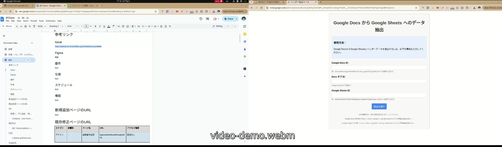

# Google Apps Script - 基本プロジェクト

このプロジェクトは、Google Sheets での自動化アプリケーションの開発を始めるための基本的な Google Apps Script プロジェクトです。

## 機能

- Google Docs のヘッダーを Google Sheets に変換する

## 要件

- 次の形式で書かれた Google ドキュメントファイル [Google Docs サンプル](https://docs.google.com/document/d/12YeJfzs2v4FBIscqSiqPB3JCgh2-X1bhSj72uhy6wjs/edit?tab=t.w66vwoc592q5#heading=h.ogtmjtsxdbdz)

  - Google ドキュメントのヘッディングが Google シートの行に変換される条件を満たすには：
    - そのヘッディングのタイトルが次の 3 つのいずれかで終わる必要があります：
      - (修正)
      - (削除)
      - (新規)
  - 例
    ```
    positions（修正） -> true
    positions -> false
    positions（新規）query -> false
    ```

- 次のようなヘッダーを持つ Google シートを事前に作成する必要があります (例: [Google Sheet サンプル](https://docs.google.com/spreadsheets/d/1gPoVdBm0sc3FyEK7aJJmpZli44Gzt-de8EcZUu-0GCE/edit?gid=0#gid=0))

  - No.
  - 項目
  - Issue
  - 担当者
  - ステータス
  - コード実装
  - 普通工数（レビューとコメント修正）
  - フロント・サーバー・DB・インフラ
  - メモ
  - start-date
  - end-date

- docsId、docsTabId、sheetId を取得する必要があります：

  ```
  // docsId -> Google ドキュメントのURLから取得 https://docs.google.com/document/d/1ICQjxuF_C0hoSqn0GLnnD500UtypweAEKWy6oKCMYjU/edit?tab=t.0#heading=h.ogtmjtsxdbdz

  docsId = 1ICQjxuF_C0hoSqn0GLnnD500UtypweAEKWy6oKCMYjU

  // docsTabId -> Google ドキュメントのURLから取得 https://docs.google.com/document/d/1ICQjxuF_C0hoSqn0GLnnD500UtypweAEKWy6oKCMYjU/edit?tab=t.0#heading=h.ogtmjtsxdbdz

  docsTabId = t.0

  // sheetId -> Google シートのURLから取得 https://docs.google.com/spreadsheets/d/1ICQjxuF_C0hoSqn0GLnnD500UtypweAEKWy6oKCMYjU/edit?gid=0#gid=0

  sheetId = 1ICQjxuF_C0hoSqn0GLnnD500UtypweAEKWy6oKCMYjU
  ```

## Google Apps Script でのデプロイ設定手順

- ステップ 1: [Google Apps Script](https://script.google.com/home) にアクセスする

  

- ステップ 2: 新しいプロジェクトを作成し、「New project」ボタンをクリックする

  

- ステップ 3: プロジェクトを設定する

  

  - ステップ 3.1: プロジェクト名を設定する (例: "Convert Google Docs to Google Sheets")
  - ステップ 3.2: 「Service」を選択する
    
  - ステップ 3.3: 「Google docs API」を選択し、「Add」ボタンをクリックする
    
  - ステップ 3.4: [GitHub リポジトリ](https://github.com/haibh-wanosoft/create-task-google-docs-to-google-sheet/blob/main/Code.gs) からコードをコピーし、Code.gs ファイルに貼り付ける
    
  - ステップ 3.5: 「Deploy」ボタンをクリックする
    
  - ステップ 3.6: 「New deployment」を選択する
    
  - ステップ 3.7: タイプを選択する
    
  - ステップ 3.8: 「Web app」を選択する
    
  - ステップ 3.9: 次の情報を入力する：
    
    - 「Who has access」の項目で、アプリにアクセスできる人に応じて「Anyone」または「Only myself」を選択する
  - ステップ 3.10: 「Deploy」ボタンをクリックする
    
  - ステップ 3.11: アクセスを許可する
    
  - ステップ 3.12: 「Allow」を選択する
  - ステップ 3.13: 「Done」ボタンをクリックする
    
    - 「Web app URL」欄のリンクをコピーし、ブラウザに貼り付けてアクセスする

## 使用手順

- ステップ 1: ステップ 3.13 のリンクにアクセスする
  
- ステップ 2: 以下の情報を入力する：
  - Google Docs ID
  - Docs タブ ID
  - Google Sheets ID
- ステップ 3: 「抽出を実行」ボタンをクリックする

---

### 結果

- ケース 1: 成功
  
- ケース 2: Google シートに既にレコードがある場合の警告 (ヘッダー行は除く)
  
- ケース 3: 失敗、いくつかの理由で：
  - アクセス権限がない
  - Google シートへのアクセス権限がない
  - その他の理由
    

### デモ動画

[](https://drive.google.com/file/d/1lKwxmNgGEFGQgZ2HxI4GtKi8HauYFKoQ/view)

上の画像をクリックすると、[Google Drive でデモ動画](https://drive.google.com/file/d/1lKwxmNgGEFGQgZ2HxI4GtKi8HauYFKoQ/view)をご覧いただけます。
