# Google Apps Script - 基本プロジェクト

このプロジェクトは、Google Sheets での自動化アプリケーションの開発を始めるための基本的な Google Apps Script プロジェクトです。

## 機能

- Google Docs のヘッダーを Google Sheets に変換する

## Requirements

- một file google docs được viết theo format sau https://docs.google.com/document/d/12YeJfzs2v4FBIscqSiqPB3JCgh2-X1bhSj72uhy6wjs/edit?tab=t.w66vwoc592q5#heading=h.ogtmjtsxdbdz

  - 1 heading trong file google docs thỏa mãn điều kiện để chuyển đổi thành 1 một row trong file google sheets khi:
    - heading đó có title kết thúc bằng một trong 3 cụm sau:
      - (修正)
      - (削除)
      - (新規)
  - ví dụ
    ```
    positions（修正） -> true
    positions -> false
    positions（新規）query -> false
    ```

- tạo sẵn một file google sheet với header là các cột sau: (ví dụ: https://docs.google.com/spreadsheets/d/1gPoVdBm0sc3FyEK7aJJmpZli44Gzt-de8EcZUu-0GCE/edit?gid=0#gid=0)

  - No.
  - 項目
  - Issue
  - 担当者
  - ステータス
  - コード実装
  - 普通工数（レビューとコメント修正）
  - フロント・サーバー・DB・インフラ
  - メモ
  - start-date
  - end-date

- cần lấy docsId, docsTabId, sheetId, ví dụ:

  ```
  // docsId -> lấy từ url của file google docs https://docs.google.com/document/d/1ICQjxuF_C0hoSqn0GLnnD500UtypweAEKWy6oKCMYjU/edit?tab=t.0#heading=h.ogtmjtsxdbdz

  docsId = 1ICQjxuF_C0hoSqn0GLnnD500UtypweAEKWy6oKCMYjU

  // docsTabId -> lấy từ url của file google docs https://docs.google.com/document/d/1ICQjxuF_C0hoSqn0GLnnD500UtypweAEKWy6oKCMYjU/edit?tab=t.0#heading=h.ogtmjtsxdbdz

  docsTabId = t.0

  // sheetId -> lấy từ url của file google sheet https://docs.google.com/spreadsheets/d/1ICQjxuF_C0hoSqn0GLnnD500UtypweAEKWy6oKCMYjU/edit?gid=0#gid=0

  sheetId = 1ICQjxuF_C0hoSqn0GLnnD500UtypweAEKWy6oKCMYjU
  ```

## Hướng dẫn setup deploy trên google app script

- Bước 1: Truy cập https://script.google.com/home

  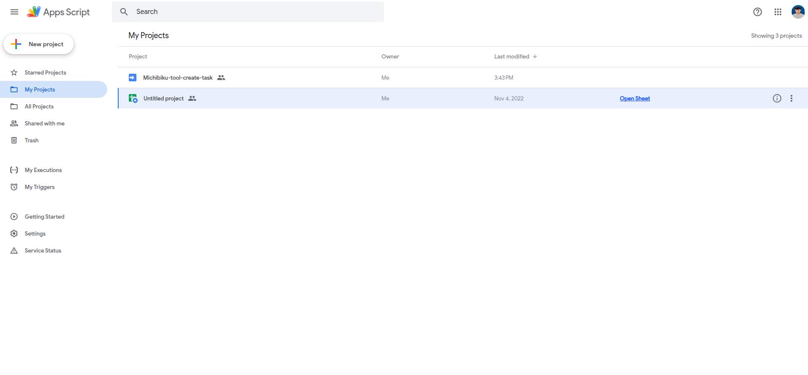

- Bước 2: Tạo mới một project, click button "New project"

  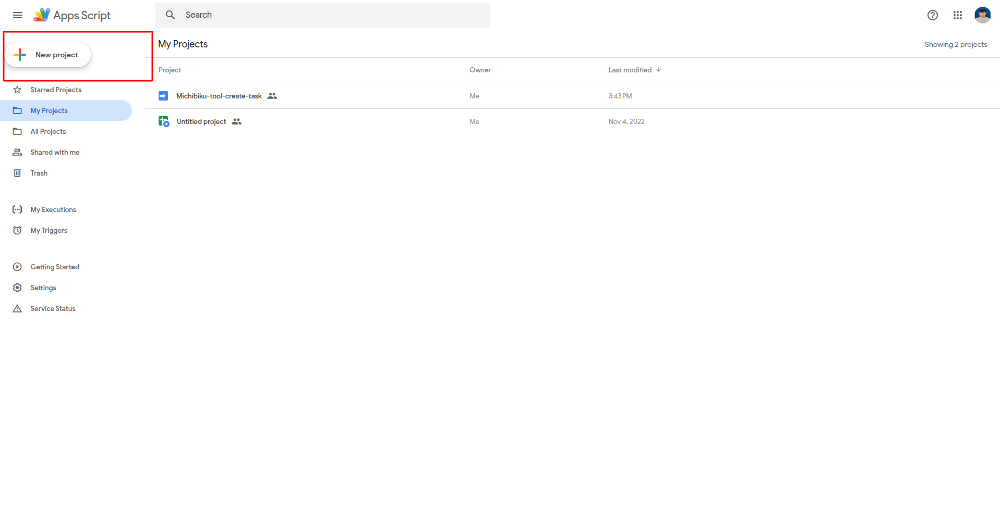

- Bước 3: Cấu hình project

  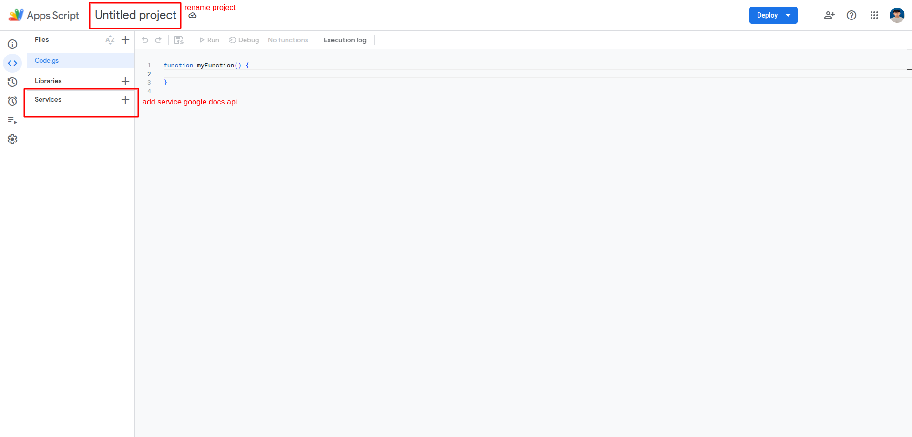

  - Bước 3.1: Đặt tên project, ví dụ: "Convert Google Docs to Google Sheets"
  - Bước 3.2: Chọn "Service"
    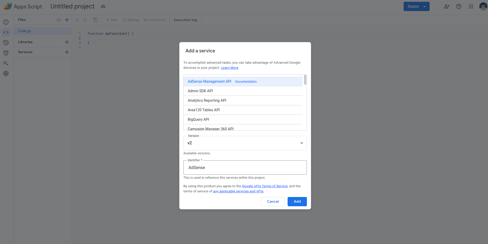
  - Bước 3.3: Chọn "Google docs API" và click button "Add"
    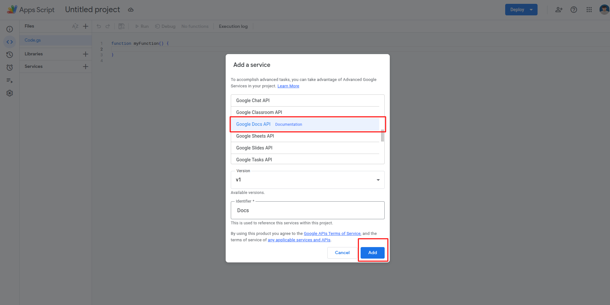
  - Bước 3.4: Copy code từ https://github.com/haibh-wanosoft/create-task-google-docs-to-google-sheet/blob/main/Code.gs và paste vào file Code.gs
    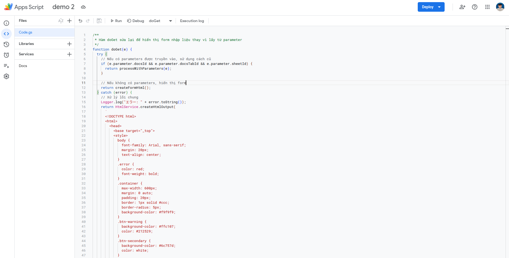
  - Bước 3.5: click button "Deploy"
    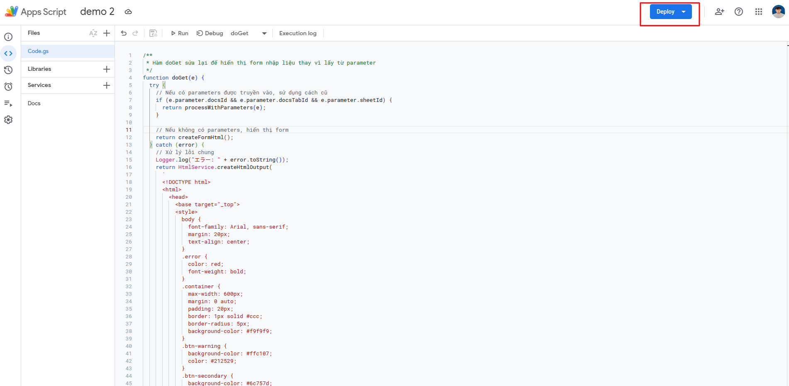
  - Bước 3.6: Chọn "New deployment"
    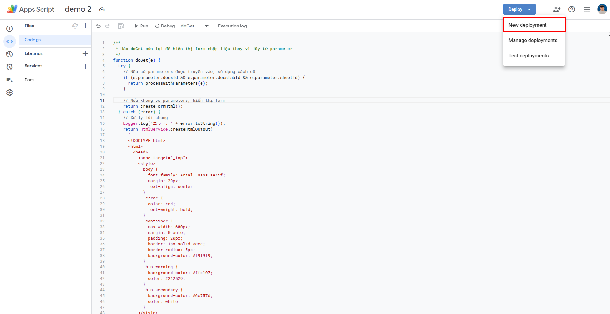
  - Bước 3.7: Chọn select type
    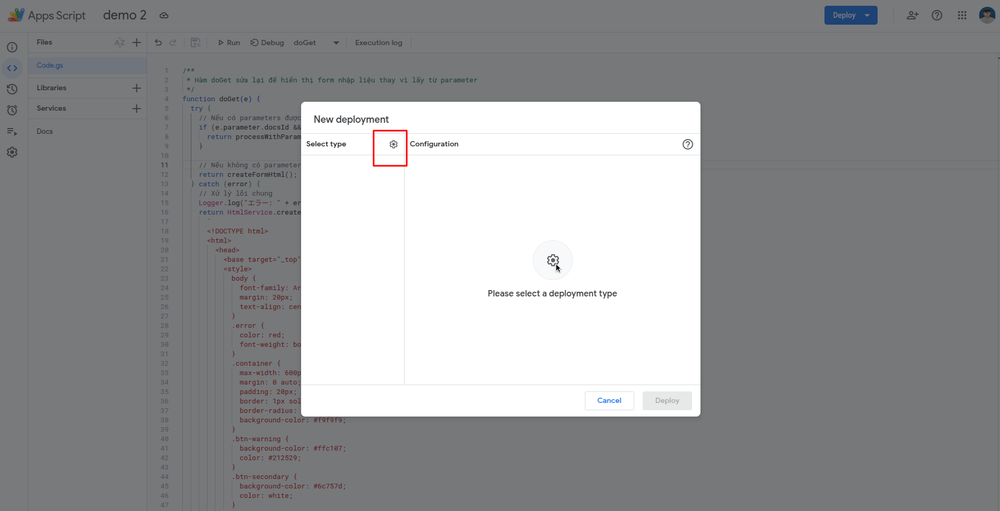
  - Bước 3.8: Chọn "Web app"
    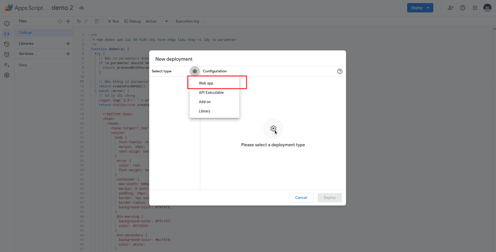
  - Bước 3.9: Nhập thông tin vào các ô sau:
    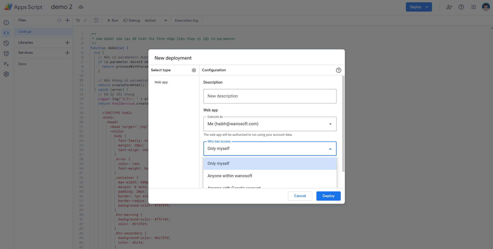
    - ở mục "Who has access" chọn "Anyone" hoặc "Only myself" tùy vào bạn muốn ai có thể truy cập vào app này
  - Bước 3.10: click button "Deploy"
    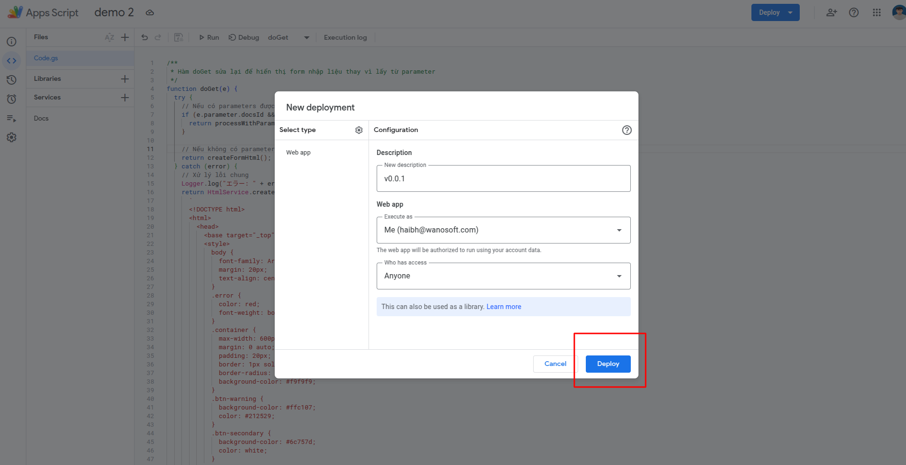
  - Bước 3.11: Authorize access
    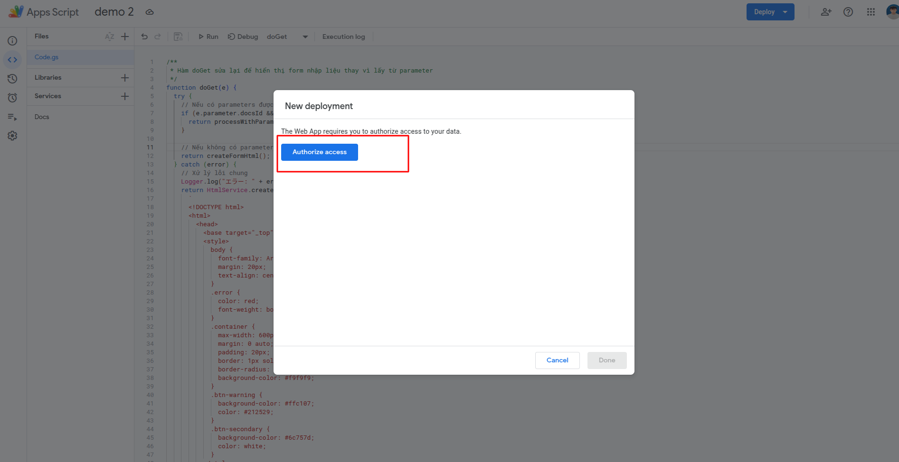
  - Bước 3.12: Chọn "Allow"
  - Bước 3.13: Click button "Done"
    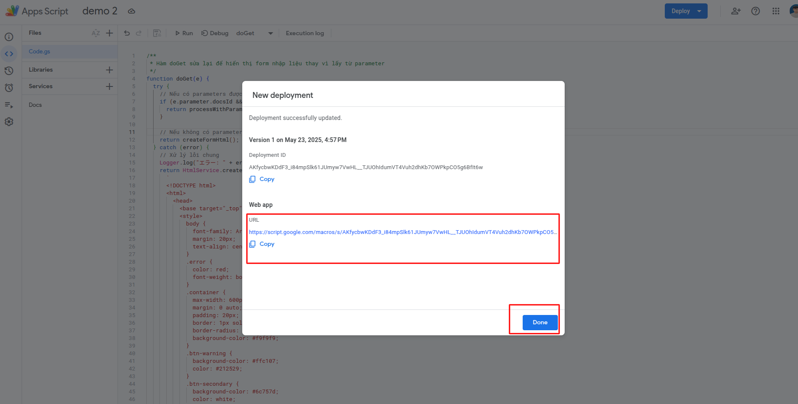
    - copy link trong ô "Web app URL" paste vào browser và truy cập

## Hướng dẫn sử dụng

- Bước 1: Truy cập vào link ở step 3.13
  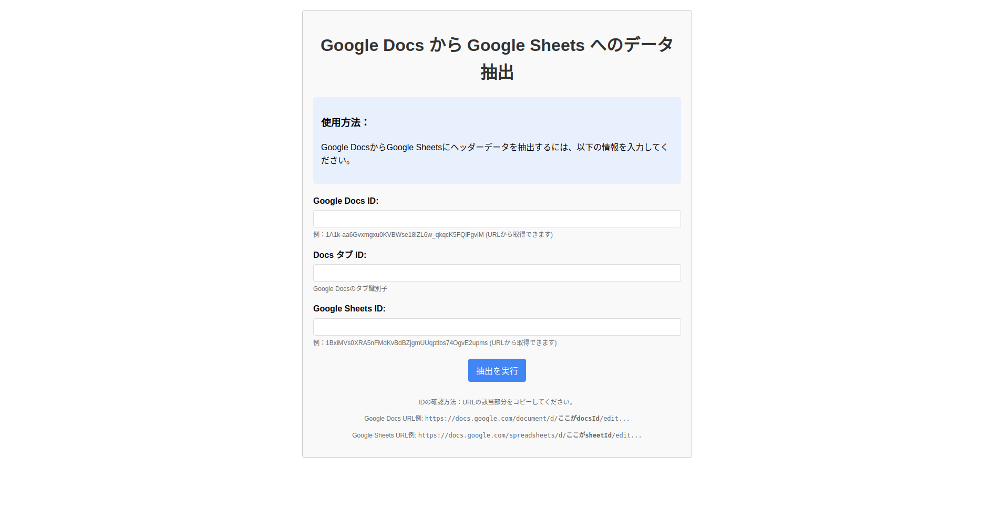
- Bước 2: Nhập thông tin vào các ô sau:
  - Google Docs ID
  - Docs タブ ID:
  - Google Sheets ID:
- Bước 3: Click button "抽出を実行"

---

### kết quả nhận được

- trường hợp 1: Thành công
  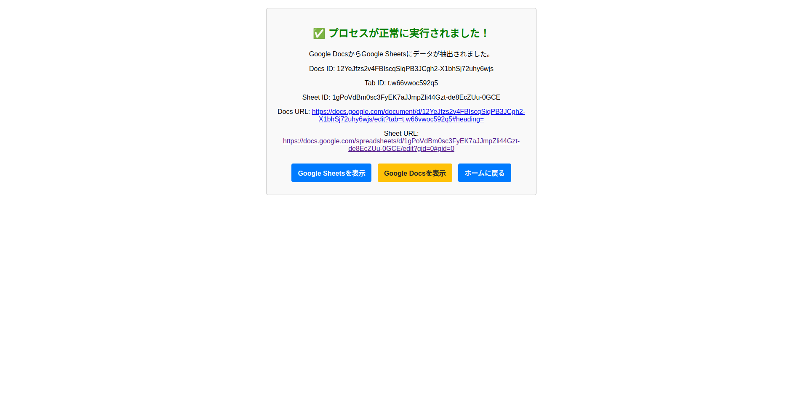
- trường hợp 2: Cảnh báo vì file google sheet đã có bản ghi (không tính row header)
  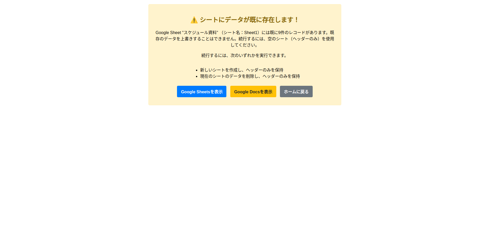
- trường hợp 3: thất bại, vì bất kỳ lý do gì ví dụ:
  - không có quyền truy cập
  - không có quyền truy cập vào file google sheet
  - ...
    

### video demo

<iframe src="https://drive.google.com/file/d/VIDEO_ID/preview" width="640" height="480" allow="autoplay"></iframe>

Tải xuống [video demo](video-demo.webm) nếu không xem được trực tiếp.
